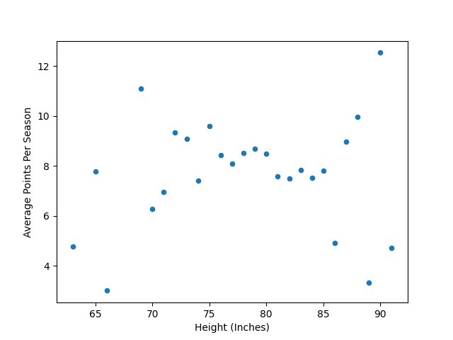
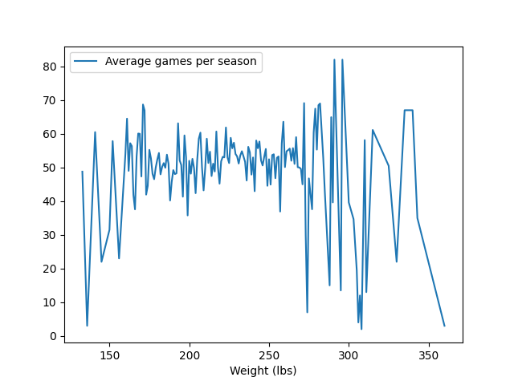

# Overview
One of my biggest hobbies is basketball. I watch a lot of NBA and play often. I also really enjoy writing software and so I decided to find a way to combine the two. I have breifly worked with pandas in the past so I decided to revist it and see if I could get some good practice in while enjoying basketball. 

[Software Demo Video](https://youtu.be/1zYLsjUABrk)

# Data Analysis Results

### Question 1: is there a correlation between player height and points averaged? 

Based off of the results there seems to be no correlation between the height of a player and the points they average. 

### Question 2: Is there any correlation between the weight of a player and the amount of games played in a season?

From the data being in either extreme of heavy or light leads a player to be more likely to play less games in a season. This is most likely because those in either extreme 
are more likely to be injured. 

# Development Environment

python 3.9, Pandas, Numpy, Matplotlib

# Useful Websites

* [Statology](https://www.statology.org/)
* [Pandas documentation](https://pandas.pydata.org/docs/)

# Future Work
* Devlop other questions that this dataset can answer. 
* Work on implementing machine learning. 